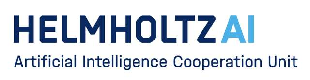

# Prologue Day 2025

  
  <!--  -->

**Welcome to the Prologue Dat at the Helmholtz AI conference 2025, June 2nd, 2025, Karlsruhe ([Full program](https://events.hifis.net/event/2137/))!**
 
This GitHub is designed to collect proposals for **Tutorials** and **Unconference** topics during the Prologue Day at
KIT. More information on how to submit a topic for a tutorial or the unconference is provided below.

# Tutorials

At the prologue day we will be offering two tutorial slots:
- **Morning Slot:** 10:30 - 12:00
- **Afternoon Slot:** 13:00 - 14:30
Tutorials give you the chance to share your knowledge on a particular topic, showcase software you have developed, or
just dive deeply into a topic that interests you. 

## 🌟 Why Hold a Tutorial

- **Share your Expertise**: Share your unique experience with a specific method or software package!
- **Showcase Your Tools**: Showcase software tools or unique methods you have developed yourself!
- **Communicate and Connect**: Communicate and connect with like-minded people over shared passions!

## 🌟 How to Propose a Tutorial Session:

1. **Create** a GitHub Issue using this [Tutorial Issue](https://github.com/Helmholtz-AI-Energy/HAICON25/issues/new?template=helmholtzai-2025--tutorial-template.md)
template.
2. **Provide** all the required information asked for in the issue template.
3. **Submit** the issue.
4. **Plan and Organize** your tutorial - and reach out to us if you have any questions or require support.

_Not sure what is a good tutorial topic? In the past we have seen tutorials on hyperparameter optimization, explainability
in machine learning, ethics in AI, and using HPC for AI research._

_If you need some help, check out these useful [tips](https://www.ctl.ox.ac.uk/planning-effective-tutorials) for organizing tutorials!_

# Unconference
Our Unconference will take place in the afternoon from **15:00 - 16:30** and provides a space for peer-to-peer learning, 
collaboration, and creativity.

Unconferences are participant-driven events where the attendees decide the topics and shape the agenda. Here, we believe 
in the collective power of bright minds coming together to spark innovation and inspire change. 
For more information on Unconferences check out [this](https://www.youtube.com/watch?v=0ai3cl-fWvE) or [this](https://unconference.net/unconferencing-how-to-prepare-to-attend-an-unconference-2/). 

## 🌟 Why Attend?

- **No Pre-set Agenda**: We go with the flow rather than following a rigid schedule. Topics are proposed and selected by participants!
- **Diverse Voices**: Everyone has a voice. Share your passion, engage in dynamic discussions, and learn from peers.
- **Networking**: Connect with like-minded individuals. The next big idea might be a conversation away!

## 🌟 What do you need?

- **A topic** - This would help to gather the right participants with similar interests.
- **A space** - ideally the venue with open space (which we will provide).
- **A facilitator** - who explains how the unconference works and crowdsources the agenda.

## 🌟 How to Propose an Unconference/ Tutorial Session:

1. **Create** a GitHub Issue using this [Unconference Issue](https://github.com/Helmholtz-AI-Energy/HAICON25/issues/new?template=helmholtzai-2025--unconference-template.md)
template.
2. **Provide** all the required information asked for in the issue template.
3. **Submit** the issue.
4. **Discuss** with collaborators and look forward to the day.

_Not sure what to talk about? Some past sessions have included AI ethics, sustainable technology, emerging tech trends, and community building._

_If you need some help, check out these typical unconference [formats](http://unconference.net/methods-2/) and helpfull [tips](https://unconference.net/unconferencing-how-to-prepare-to-attend-an-unconference-2/)!_

# 📅 Event Details

- **Date**: June 2nd, 2025 
- **Location**:   KIT Campus Nord 
- **Tutorials** *(Morning slot)*: 10:30 AM - 12:00 PM
- **Tutorials** *(Afternoon slot)*: 01:00 PM - 02:30 PM 
- **Unconference**: 03:00 PM - 05:00 PM 

# 🎟️ How to Register

Simply [click here](#RegistrationLink) to fill out our registration for the Helmholtz AI Conference 2025 and choose to attend the event!

---

💬 **Join the conversation and help shape the future at Tutorials and Unconference 2025!** 🚀

---

⭐ *If you have any questions or need additional information, don't hesitate to contact [HAI Consultant Team - KIT](mailto:consultant-helmholtz.ai@kit.edu).* ⭐

## 💡 General Tips

📜 Comment on existing issues if you have any thoughts or questions about it. You can also mention how you could contribute or anything else relevant to the idea.

📜 Use the issue template to put your abstract in the right shape - these issue templates vary depending if you are offering a **Tutorial** or an **Unconference Topic**.

📜 Please make sure that your session ideas are understandable to everyone. We come from different fields. Use as little jargon as possible. 💁

👍 Please vote on project ideas/issues that you consider interesting.
